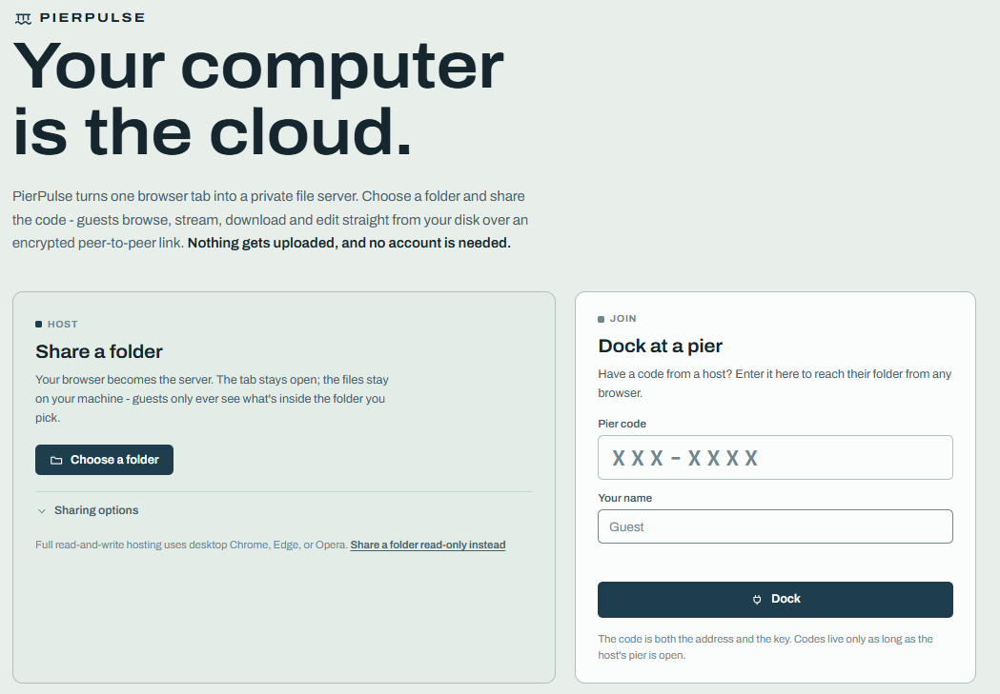

<div align="center">

# 🌊 PierPulse

**Your computer is the cloud.**
Browse, discuss, and edit files together with anyone - right in the browser.

No uploads. No cloud storage. No accounts.

[](https://pierpulse.com)
[](#how-it-works)
[](#how-it-works)
[](#faq)
[](#license)

[**Live Demo**](https://pierpulse.com) · [Features](#-features) · [How It Works](#-how-it-works) · [Getting Started](#-getting-started) · [FAQ](#-faq)



</div>

---

## 📖 Table of Contents

- [What is PierPulse?](#-what-is-pierpulse)
- [Features](#-features)
- [How It Works](#-how-it-works)
- [Getting Started](#-getting-started)
- [Try the Demo](#-try-the-demo-no-files-required)
- [Supported File Types](#-supported-file-types)
- [Browser Compatibility](#-browser-compatibility)
- [Privacy & Security Model](#-privacy--security-model)
- [Advanced: Self-Hosting the Signaling Server](#-advanced-self-hosting-the-signaling-server)
- [FAQ](#-faq)
- [Roadmap](#-roadmap)
- [Contributing](#-contributing)
- [License](#-license)

---

## 🧭 What is PierPulse?

PierPulse lets other people **see and work on the files on your computer**, live, from their own browser, anywhere in the world - with no uploading, no syncing, and no "I'll email you the latest version."

It works in four simple steps:

| Step | Action |
|------|--------|
| 1️⃣ | **You host.** Open [pierpulse.com](https://pierpulse.com), pick the folders (or entire drives) you want to share, and a "pier" opens for your session. |
| 2️⃣ | **You invite.** Send the session link - or a scannable QR code - to whoever needs access. |
| 3️⃣ | **They dock.** Guests open the link (or scan the code) in any modern browser. Nothing to install, no account to create. |
| 4️⃣ | **You work together.** Everyone browses the same files at the same time, edits documents together, and talks it over in the built-in chat sidebar. |

The core idea: **your files never leave your computer.** They're not copied to Google Drive, Dropbox, or any server. While a pier is open, PierPulse streams your files directly, browser-to-browser, to your guests over an encrypted peer-to-peer connection. Close it, and your files exist in exactly one place - yours.

> 

---

## ✨ Features

### 📱 Join by Scanning a QR Code
Every hosted session shows a QR code alongside the invite link, generated entirely inside the browser tab - no external service call involved. Anyone with a phone can scan it and be browsing your shared folder in seconds, no link to copy-paste or type.

### 🗂️ One File Browser, Shared Live
Everyone in a session sees the same folder at the same time. A presence line ("3 people viewing this folder"), live typing indicators, and one-click jumps (mention a file in chat and everyone can fly straight to it) keep the room feeling real. Prefer to give a guided tour instead of letting people wander? **Follow Mode** lets one person drive while everyone else rides along - and the wheel can be handed off at any time. A built-in **search** (scoped to the current folder or across everything) and **sort** control, plus list/grid view toggles, make navigating a large shared drive painless - and a keyboard-shortcuts panel is one click away for anyone who prefers not to touch the mouse.

### 💬 A Chat That Lives Next to Your Files
The sidebar is scoped to wherever you are - the conversation happening in `Invoices` stays in `Invoices`. React to messages with emoji, send voice notes when typing is too slow, and paste in screenshots you can annotate with a quick markup tool before sending. Need to make a call on something? Fire off a quick poll, and the result is saved to a **decision log** so it never gets lost in the scroll. A **pinned-files shelf** keeps whatever matters one click away.

### 📄 PDFs, Reviewed Together
Open a PDF with your team and page turns stay in sync - nobody is ever asking "wait, which page are you on?" Draw on the document live, with everyone's ink rendered in their own color. Need actual edits instead of comments? The built-in page toolkit reorders, rotates, deletes, extracts, and merges pages, and you can export with the annotations burned in when you're done.

### 📊 Office Files, No Office Needed
Open, view, **and edit** Word (`.docx`), Excel (`.xlsx`), and PowerPoint (`.pptx`) files directly in the browser - complete with a formula bar and cell-reference jump box for spreadsheets, click-to-edit text blocks and slide navigation for decks, and full undo/redo everywhere. When you save, the edited file is written straight back to the host's drive - the original file, in place, with formatting, merges, charts, layouts, masters and media all carried over untouched.

### 🎬 Real Video & Audio Streaming
Video and audio stream straight off the host's disk with byte-range seeking, so scrubbing to the middle of a two-hour file doesn't mean downloading two hours of it first. If the browser can't natively decode a format, PierPulse converts a playback copy on the fly using an in-browser FFmpeg engine - the original file is never touched.

### 📺 Watch Together, with Subtitles and AirPlay
**Watch Together** syncs play, pause, and seek across everyone viewing the same video or audio file - press play once and the whole group watches in lockstep. Matching `.srt` or `.vtt` subtitle files sitting next to a video are picked up and rendered automatically. When you'd rather watch on the big screen, a built-in **AirPlay** button sends the picture straight to a TV or speaker.

### 📁 Fast, Verified Downloads That Share the Load
Downloads are chunked, resumable, and checksum-verified as they arrive, so a dropped connection or a flaky network never means starting over or trusting a corrupted file. When more than one guest wants the same large file, completed downloads can optionally mirror to other guests directly (peer-to-peer, BitTorrent-style) - every byte is still hash-verified, so a bad or malicious peer just leaves a gap the host fills in, and the host's own upload bandwidth is spared.

### 📝 Code, Text, and Data, Rendered Properly
Dozens of text and code file types open with full syntax highlighting. Markdown files render as a formatted document with a one-click toggle back to raw source - handy for previewing another project's README. CSV and TSV files open as a proper scrollable table instead of a wall of commas.

### 💽 Dock Every Drive You Own
**Multi-Drive Docking** lets a host attach several drives or folders at once - `C:`, `D:`, `F:`, an external disk - and the whole group navigates between them like ordinary folders. Your entire computer becomes one shared workspace.

### 🔑 You Control Who Can Do What
Guests can view by default; a host grants edit or download access per guest, and a guest without it can send a one-click **request** rather than asking over voice chat. Revoke access at any time by closing the pier.

### ⏪ Never Miss a Thing
Joined the session late? **Catch-Me-Up Replay** shows exactly what was opened, said, and decided while you were away - the meeting minutes nobody had to write.

### 🌗 Light or Dark, Your Call
A one-click theme switcher flips the whole interface between light and dark.

---

## ⚙️ How It Works

PierPulse has no backend storage layer. A lightweight signaling server helps host and guests find each other, but once connected, files move over a direct, DTLS-encrypted WebRTC link - browser to browser.

```
      YOUR COMPUTER                  THE RELAY                    GUESTS
 ┌─────────────────────┐        ┌────────────────┐        ┌─────────────────────┐
 │    Host browser     │        │  a small relay │        │   Guest browsers    │
 │                     │        │                │        │                     │
 │  • your real files  │ ◀────▶│  passes bytes │ ◀────▶ │  • view + edit      │
 │  • reads them       │        │  through,      │        │  • chat + draw      │
 │    straight off     │        │  stores        │        │  • any modern       │
 │    the disk         │        │  NOTHING       │        │    browser          │
 │  • saves edits      │        │                │        │                     │
 │    back to disk     │        │                │        │                     │
 └─────────────────────┘        └────────────────┘        └─────────────────────┘
                    └──────── encrypted WebRTC data channel ────────┘
```

- The **host's browser** reads files directly from the host's computer and writes every edit straight back to it.
- Signaling only brokers the introduction; the actual bytes flow directly between host and guest over an encrypted peer-to-peer channel, never through a PierPulse server.
- When the host closes the pier, guest access ends immediately - and since nothing was ever copied anywhere, there's nothing left to clean up.

---

## 🚀 Getting Started

The fastest way to use PierPulse is the hosted app - no installation required.

1. Go to **[pierpulse.com](https://pierpulse.com)**
2. Click **Host** and select the folder(s) or drive(s) you want to share
3. Send the generated invite link - or have guests scan the on-screen QR code - to your collaborators
4. They open the link (or scan the code). That's the entire setup

**Good to know:**

| Role | Requirement |
|------|-------------|
| **Host** | Desktop **Chrome**, **Edge**, or **Opera** (Chromium-based browsers support direct, sandboxed read/write access to local files via the File System Access API) |
| **Guest** | Any modern browser - desktop or mobile |

---

## 🧪 Try the Demo (No Files Required)

Not ready to share your own files yet? PierPulse can generate a fake folder of sample documents, images, PDFs, spreadsheets and more, entirely inside the browser tab - nothing on your disk is touched and nothing persists after you close it. It's the fastest way to see every feature - editing, chat, PDF annotation, video sync - without risking a single real file.

---

## 📁 Supported File Types

| Type | Capability |
|------|------------|
| Folders & general files | Browse, download, discuss |
| Images | View inline |
| PDF | View, annotate live, reorder/rotate/delete/extract/merge pages, export |
| Word (`.docx`) | View and edit collaboratively |
| Excel (`.xlsx`) | View and edit collaboratively, with formula bar and cell navigation |
| PowerPoint (`.pptx`) | View and edit collaboratively, with click-to-edit text blocks |
| Video & Audio | Streamed playback with seeking, subtitles, synced Watch Together, AirPlay casting, and automatic format conversion for unsupported codecs |
| Markdown (`.md`) | Rendered as a formatted document, with a toggle to raw source |
| CSV / TSV | Rendered as a scrollable table |
| Code & plain text | Dozens of languages, with syntax highlighting |

More formats are on the way - see the [Roadmap](#-roadmap).

---

## 🌐 Browser Compatibility

Hosting requires a browser with support for direct local file system access:

- ✅ Google Chrome (desktop)
- ✅ Microsoft Edge (desktop)
- ✅ Opera (desktop)

Guests can join a session from virtually any modern browser, on desktop or mobile, with no special requirements.

---

## 🔒 Privacy & Security Model

- **No cloud storage.** Files are never copied to or persisted on any server.
- **No accounts.** There's nothing to sign up for and nothing tied to an identity.
- **Encrypted, direct transport.** File data travels over a DTLS-encrypted WebRTC connection directly between browsers; a lightweight signaling step only helps peers find each other and never sees file contents.
- **Host-controlled access.** The host decides who can view, download, or edit, and can grant or revoke permissions - including responding to guest access requests - at any time by closing the pier.
- **Verified transfers.** Downloaded chunks are checksum-verified as they arrive, including chunks mirrored from other guests, so a dropped connection or an untrustworthy peer can't silently corrupt a file.
- **Ephemeral by design.** Once a session ends, there's no residual data anywhere to secure or delete.

---

## 🛠️ Advanced: Self-Hosting the Signaling Server

By default, PierPulse's signaling step uses a public service to help peers connect. Organizations with stricter requirements can point the app at their own signaling server instead, keeping the introduction step entirely in-house. (This never changes where file *data* flows - that's always a direct, encrypted connection between browsers.)

---

## ❓ FAQ

**So where do my files actually go?**
Nowhere. That's the entire point. Files are read from the host's disk, streamed directly to guests' browsers over an encrypted peer-to-peer connection, and any edits are saved back to the host's disk. Nothing is stored on a server along the way. Once the session ends, the files exist only on the host's computer, exactly as before.

**What happens when the host goes offline?**
The pier closes immediately, and guests lose access - there's no copy of the files anywhere else to fall back on. A new session can be opened at any time.

**Can guests edit or download my files?**
Only if you explicitly grant that permission. Guests without access can send a one-click request, but the host always stays in control of who can view, download, and change things.

**Do I need an account?**
No. No sign-up, no login, no profile - just open the site and start.

**Is it free?**
Yes, PierPulse is currently free to use.

**Which files can we work on together?**
Folders, images, PDFs, Microsoft Office documents (Word, Excel, PowerPoint), video and audio, Markdown, CSV/TSV, and general code or text files, with more formats planned.

**Can I try it without sharing real files?**
Yes - the demo mode generates a sample folder inside the browser tab that never touches your real disk.

---

## 🗺️ Roadmap

- [ ] Additional supported file formats
- [ ] Richer in-browser editing capabilities

Have a feature request? Open an issue to discuss it.

---

## 📜 License

Released under the **MIT License**. See [`LICENSE`](./LICENSE) for full details.

---

<div align="center">

*PierPulse - the heartbeat of your workspace.*

[pierpulse.com](https://pierpulse.com)

</div>
